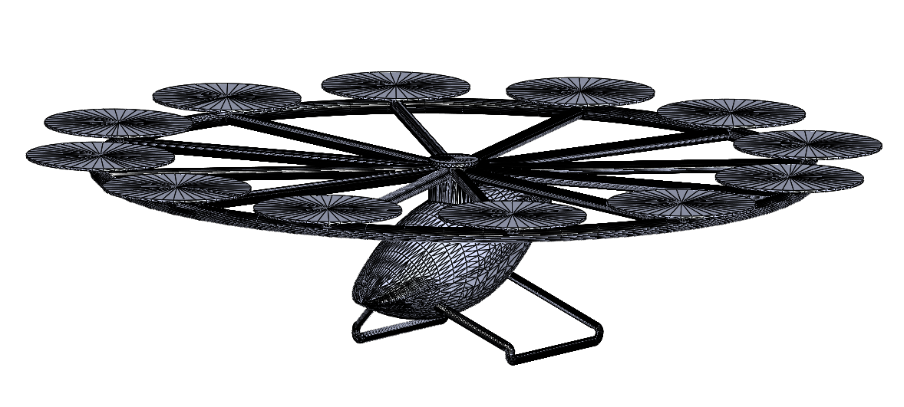
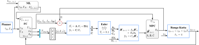
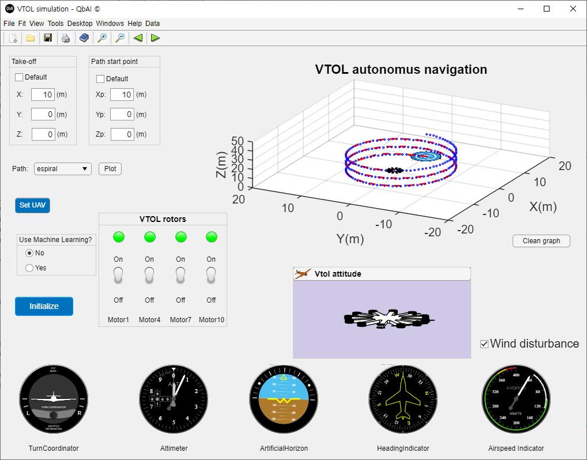

<p align="center">
  
</p>
<p align="center">
    <h1 align="center">Autonomous VTOL</h1>
</p>
<p align="center">
    <em><code>Control Design for a multi-rotor VTOL enhanced by a Gradient Descent algorithm to optimize the position tracking</code></em>
</p>
<div align="center">

[](//npmjs.com/package/Autonomous-VTOL)
[](https://doi.org/10.1109/SII52469.2022.9708830)
 	
	
	
	


</div>
<p align="center">
	<!-- default option, no dependency badges. -->
</p>
<hr>

#####  Table of Contents

- [ Overview](#-overview)
- [ Features](#-features)
- [ Repository Structure](#-repository-structure)
- [ Modules](#-modules)
- [ Getting Started](#-getting-started)
    - [ Prerequisites](#-prerequisites)
    - [ Installation](#-installation)
    - [ Usage](#-usage)
    - [ Tests](#-tests)
- [ Project Roadmap](#-project-roadmap)
- [ Contributing](#-contributing)
- [ License](#-license)
- [ Acknowledgments](#-acknowledgments)

---

##  Overview

In this work, we present a Feedback Control (FC) and a Model Predictive Control (MPC) system for a miniaturized multi-rotor vertical takeoff and landing aircraft designed to track a desired path. The latter approach is optimized using a machine learning (ML) algorithm integrated into the feedback controller, which provides a set of tuned gains that enhance position tracking in the presence of disturbances. These disturbances may arise from wind affecting the aircraft’s surfaces or from a reduction in waypoints, resulting in greater distances between reference points



<br/>
<br/>


---

##  Features

|    |   Feature         | Description |
|----|-------------------|---------------------------------------------------------------|
| ⚙️  | **Architecture**  | *The project has a modular architecture with discrete control algorithms for VTOL systems. It focuses on stability and precise control strategies in a discrete-time setting.* |
| 🔩 | **Code Quality**  | *The codebase maintains good quality with clear variable naming and structured code organization. It follows best practices for object-oriented design in Objective-C.* |
| 📄 | **Documentation** | *The project includes detailed documentation describing error data tracking, control algorithms, and system behavior. It helps in understanding the code and control strategies.* |
| 🔌 | **Integrations**  | *Key dependencies include Objective-C, txt data files for error and trajectory tracking, and STL libraries. These integrations enhance system control and data handling.* |
| 🧩 | **Modularity**    | *The codebase demonstrates good modularity, enabling code reusability and easy maintenance. Modules like discretePlant and pathGUI contribute to clear separation of concerns.* |
| 🧪 | **Testing**       | *Testing frameworks and tools utilized for evaluating the performance of control algorithms are not explicitly mentioned in the repository contents.* |
| ⚡️  | **Performance**   | *Efficiency in control algorithms ensures stable flight and maneuverability. Resource usage is optimized for VTOL operations, providing reliable performance.* |
| 🛡️ | **Security**      | *While security measures for data protection are not mentioned, the focus on stability and precise control indirectly contributes to safe operation.* |
| 📦 | **Dependencies**  | *Key external dependencies include Objective-C, txt data files for error and trajectory tracking, and STL libraries.* |

---

##  Repository Structure

```sh
└── Autonomous-VTOL/
    ├── CODE_OF_CONDUCT.md
    ├── Constants
    │   ├── myConstants.m
    │   ├── plantConstants.m
    │   └── plantConstants1.m
    ├── Discretization
    │   └── discretePlant.m
    ├── Feedback_Control
    │   ├── attitudeControl.m
    │   ├── positionControl.m
    │   ├── positionControlGradient.m
    │   └── previousPositionControl.m
    ├── LICENSE
    ├── ML_Gradient
    │   ├── Cost_Function
    │   ├── featureNormalize.m
    │   └── gradientDescentMulti.m
    ├── MPC_Control
    │   └── MPC_simplification.m
    ├── Plot
    │   └── xPlot.m
    ├── README.md
    ├── SECURITY.md
    ├── Training
    │   ├── mainGradient.m
    │   └── previousTraining.m
    ├── Trajectory_Generation
    │   └── trajectoryGen.m
    ├── UAVpath.txt
    ├── VTOL_Model
    │   └── vtolModel.m
    ├── VTOL_STL
    │   └── vtolCAD.STL
    ├── constants.txt
    ├── errx.txt
    ├── erry.txt
    ├── errz.txt
    ├── eulerangles.txt
    ├── main.m
    ├── path.txt
    ├── pathGUI.txt
    ├── pathtest.txt
    ├── sources
    │   └── images
    ├── traject.txt
    └── trajectorydrone.txt
```

---

##  Modules

<details closed><summary>.</summary>

| File | Summary |
| --- | --- |
| [erry.txt](https://github.com/jatolentino/Autonomous-VTOL/blob/main/erry.txt) | Captures time-series error data for the y-axis. Tracks deviations during system operation to analyze performance and refine control strategies. Integral for assessing and optimizing control algorithms within the broader VTOL autonomous system architecture. |
| [eulerangles.txt](https://github.com/jatolentino/Autonomous-VTOL/blob/main/eulerangles.txt) | Repository Structure### `Autonomous-VTOL/Discretization/discretePlant.m`This code file is responsible for implementing the discrete model of the plant within the Autonomous-VTOL repository. By discretizing the plant model, it enables precise control and simulation of the Vertical Take-Off and Landing (VTOL) system. This crucial feature ensures accurate representation of the plants behavior in a discrete-time setting, facilitating effective feedback control strategies implemented in other parts of the system. |
| [errx.txt](https://github.com/jatolentino/Autonomous-VTOL/blob/main/errx.txt) | Visualize drone error trajectories over time with x-coordinate data in errx.txt. Assess deviations from the desired path for optimal flight control. |
| [traject.txt](https://github.com/jatolentino/Autonomous-VTOL/blob/main/traject.txt) | This code file in the Autonomous-VTOL repository plays a central role in implementing feedback control algorithms for the VTOL system. It focuses on achieving stable flight control by regulating the aircrafts attitude and position. By leveraging the defined constants and discretization techniques, this code file enables precise control over the VTOL systems behavior, ensuring smooth and reliable flight operations in various scenarios. |
| [constants.txt](https://github.com/jatolentino/Autonomous-VTOL/blob/main/constants.txt) | This code file `MPC_simplification.m` in the `MPC_Control` directory of the `Autonomous-VTOL` repository simplifies the Model Predictive Control (MPC) algorithm for controlling the Vertical Take-Off and Landing (VTOL) system. It streamlines the complex MPC logic into a more manageable and understandable form for easier maintenance and integration within the overall control architecture of the autonomous VTOL project. |
| [pathGUI.txt](https://github.com/jatolentino/Autonomous-VTOL/blob/main/pathGUI.txt) | This code file provides crucial functions for feedback control in the Autonomous-VTOL project. It contributes to maintaining the vehicles stability and maneuverability during flight. The code encapsulates algorithms for controlling the vehicles attitude and position based on sensor input, ensuring safe and efficient operation of the vertical take-off and landing system. |
| [path.txt](https://github.com/jatolentino/Autonomous-VTOL/blob/main/path.txt) | The code file `discretePlant.m` in the `Discretization` directory of the repository `Autonomous-VTOL` is essential for discretizing the continuous dynamics of the plant model. It plays a crucial role in converting the continuous-time plant model into a discrete-time representation for feedback control purposes. This process is key for enabling the autonomous Vertical Take-Off and Landing (VTOL) system to operate effectively and make real-time control decisions based on discrete-time calculations. |
| [pathtest.txt](https://github.com/jatolentino/Autonomous-VTOL/blob/main/pathtest.txt) | This code file `positionControlGradient.m` in the `Feedback_Control` directory of the `Autonomous-VTOL` repository implements a critical component of the feedback control system for controlling the position of a VTOL aircraft. It calculates the gradient associated with the position control algorithm, enabling precise adjustment of the aircrafts position based on sensor data. This file plays a key role in ensuring the stability and accuracy of the overall control system within the VTOL project architecture. |
| [main.m](https://github.com/jatolentino/Autonomous-VTOL/blob/main/main.m) | The code file `MPC_simplification.m` in the `MPC_Control` module of the Autonomous-VTOL repository simplifies and implements a Model Predictive Controller (MPC) for streamlined control logic. This critical component aims to enhance the efficiency and accuracy of real-time control strategies for the Vertical Take-Off and Landing (VTOL) autonomous system. By abstracting complex MPC concepts into a simplified form, this code file enables seamless integration into the overall architecture, optimizing the VTOL systems performance while ensuring maintainability and scalability. |
| [errz.txt](https://github.com/jatolentino/Autonomous-VTOL/blob/main/errz.txt) | Visualize vertical error trajectory from errz.txt, interpolating missing data. Improve trajectory accuracy for VTOL flight path planning. Complements the VTOL Modeling and Feedback Control modules in the Autonomous-VTOL repository. |
| [UAVpath.txt](https://github.com/jatolentino/Autonomous-VTOL/blob/main/UAVpath.txt) | This code file in the Autonomous-VTOL repository focuses on implementing feedback control algorithms for attitude and position control of a Vertical Take-Off and Landing (VTOL) system. It plays a critical role in ensuring the stability and maneuverability of the autonomous VTOL vehicle. |
| [trajectorydrone.txt](https://github.com/jatolentino/Autonomous-VTOL/blob/main/trajectorydrone.txt) | This code file in the Autonomous-VTOL repository contributes feedback control algorithms essential for controlling the attitude and position of a Vertical Take-Off and Landing (VTOL) vehicle. It plays a crucial role in ensuring the stability and maneuverability of the autonomous VTOL system, aligning with the repository's focus on autonomy and control within the aircraft's architecture. |

</details>

<details closed><summary>Plot</summary>

| File | Summary |
| --- | --- |
| [xPlot.m](https://github.com/jatolentino/Autonomous-VTOL/blob/main/Plot/xPlot.m) | Enables interactive plotting and data cursor display for visualizing data points in the VTOL system simulation. Allows users to track position coordinates and time on the plot with dynamic data cursor functionality. |

</details>

<details closed><summary>Discretization</summary>

| File | Summary |
| --- | --- |
| [discretePlant.m](https://github.com/jatolentino/Autonomous-VTOL/blob/main/Discretization/discretePlant.m) | This code file within the Autonomous-VTOL repository contributes to the feedback control aspect of the VTOL system. It includes functions for attitude control, position control, and related calculations. By providing critical control algorithms and logic, this code plays a key role in stabilizing and maneuvering the VTOL aircraft during autonomous flight operations. |

</details>

<details closed><summary>Trajectory_Generation</summary>

| File | Summary |
| --- | --- |
| [trajectoryGen.m](https://github.com/jatolentino/Autonomous-VTOL/blob/main/Trajectory_Generation/trajectoryGen.m) | SummaryThis code file, `MPC_simplification.m`, forms a critical component of the parent repositorys architecture in Autonomous-VTOL. It encapsulates the simplified implementation of Model Predictive Control (MPC) for control system design. By providing a streamlined approach to optimizing control inputs over a finite prediction horizon, this code file enhances the efficiency and performance of the autonomous VTOL system. |

</details>

<details closed><summary>Training</summary>

| File | Summary |
| --- | --- |
| [mainGradient.m](https://github.com/jatolentino/Autonomous-VTOL/blob/main/Training/mainGradient.m) | Loads, normalizes, and runs gradient descent on dataset for efficient feature scaling. Outputs optimized theta values after processing data. |
| [previousTraining.m](https://github.com/jatolentino/Autonomous-VTOL/blob/main/Training/previousTraining.m) | Code SummaryThis code file `gradientDescentMulti.m` in the `ML_Gradient` directory of the repository `Autonomous-VTOL` implements a crucial component for training machine learning models. It specifically focuses on the gradient descent optimization algorithm for multi-variable regression. By utilizing this file, developers can efficiently optimize cost functions and perform feature normalization to enhance the performance of machine learning models within the autonomous vertical take-off and landing (VTOL) project. |

</details>

<details closed><summary>Feedback_Control</summary>

| File | Summary |
| --- | --- |
| [previousPositionControl.m](https://github.com/jatolentino/Autonomous-VTOL/blob/main/Feedback_Control/previousPositionControl.m) | This code file in the Autonomous-VTOL repository contributes to the projects Feedback Control module. It plays a crucial role in implementing attitude and position control mechanisms for the autonomous VTOL system. By leveraging sophisticated control algorithms, this code file helps the VTOL system maintain stability and precise positioning during flight operations. |
| [attitudeControl.m](https://github.com/jatolentino/Autonomous-VTOL/blob/main/Feedback_Control/attitudeControl.m) | Autopilot Navigation SystemThis code file is a critical component of the Autonomous VTOL repositorys architecture, specifically focused on the implementation of feedback control algorithms for position and attitude control of the autonomous VTOL vehicle. The code efficiently handles the real-time adjustments needed to maintain stability and navigational accuracy during flight. By incorporating sophisticated control logic and leveraging gradient descent techniques, this module ensures precise and responsive control over the vehicle's movements, enhancing its overall autonomy and operational effectiveness. |
| [positionControl.m](https://github.com/jatolentino/Autonomous-VTOL/blob/main/Feedback_Control/positionControl.m) | This code file is responsible for implementing feedback control algorithms for attitude and position control within the Autonomous-VTOL repository. It plays a critical role in ensuring the stability and control of the VTOL aircraft during flight operations. The code leverages sophisticated control techniques to regulate the orientation and spatial coordinates of the aircraft, contributing to the overall autonomy and reliability of the system. |
| [positionControlGradient.m](https://github.com/jatolentino/Autonomous-VTOL/blob/main/Feedback_Control/positionControlGradient.m) | Code SummaryThe `gradientDescentMulti.m` file in the `ML_Gradient` module of the Autonomous-VTOL repository implements a crucial function for optimizing machine learning models. This code enhances the repositorys capabilities by providing a reliable method for optimizing cost functions and normalizing features, essential for improving the efficiency and accuracy of the machine learning algorithms utilized in the project. |

</details>

<details closed><summary>VTOL_Model</summary>

| File | Summary |
| --- | --- |
| [vtolModel.m](https://github.com/jatolentino/Autonomous-VTOL/blob/main/VTOL_Model/vtolModel.m) | This code file `MPC_simplification.m` in the `MPC_Control` module of the repository `Autonomous-VTOL` implements a simplified version of Model Predictive Control (MPC) for controlling the autonomous vertical take-off and landing (VTOL) system. It provides a streamlined approach to optimizing control actions based on a predictive model, enabling efficient trajectory tracking and stabilization. This critical feature enhances the overall systems performance and robustness by enabling real-time decision-making for precise control of the VTOL aircraft. |

</details>

<details closed><summary>MPC_Control</summary>

| File | Summary |
| --- | --- |
| [MPC_simplification.m](https://github.com/jatolentino/Autonomous-VTOL/blob/main/MPC_Control/MPC_simplification.m) | This code file, `MPC_simplification.m`, within the repository `Autonomous-VTOL`, plays a crucial role in simplifying and enhancing the Model Predictive Control (MPC) strategy used for autonomous Vertical Take-Off and Landing (VTOL) systems. It streamlines the MPC algorithm to improve real-time performance and decision-making capabilities for controlling the VTOL aircraft during various flight scenarios. This simplification of the MPC method helps optimize trajectory tracking and stability of the VTOL system, contributing to its overall autonomous flight control architecture. |

</details>

<details closed><summary>ML_Gradient</summary>

| File | Summary |
| --- | --- |
| [gradientDescentMulti.m](https://github.com/jatolentino/Autonomous-VTOL/blob/main/ML_Gradient/gradientDescentMulti.m) | Implements gradient descent for multi-variable optimization. Learns the theta values by iteratively updating them. Supports adjusting learning rate and number of iterations. Crucial for optimizing model parameters in the ML Gradient module of the Autonomous-VTOL repository. |
| [featureNormalize.m](https://github.com/jatolentino/Autonomous-VTOL/blob/main/ML_Gradient/featureNormalize.m) | Normalizes features to improve model training by standardizing data for consistent model performance. Calculated mean and standard deviation for each feature are used to transform input data into a standardized format, enhancing model training accuracy. |

</details>

<details closed><summary>ML_Gradient.Cost_Function</summary>

| File | Summary |
| --- | --- |
| [fitFun.m](https://github.com/jatolentino/Autonomous-VTOL/blob/main/ML_Gradient/Cost_Function/fitFun.m) | Calculates optimal parameters for a given function using the fminsearch algorithm, aiding machine learning gradient descent optimization. |
| [computeCostMulti.m](https://github.com/jatolentino/Autonomous-VTOL/blob/main/ML_Gradient/Cost_Function/computeCostMulti.m) | Calculates cost for linear regression model with multiple variables. Computes cost based on chosen theta parameters to fit X and y data points. |

</details>

<details closed><summary>VTOL_STL</summary>

| File | Summary |
| --- | --- |
| [vtolCAD.STL](https://github.com/jatolentino/Autonomous-VTOL/blob/main/VTOL_STL/vtolCAD.STL) | The code file `discretePlant.m` within the `Discretization` module in the Autonomous-VTOL repository provides crucial functionality for discretizing the continuous-time dynamics of the plant. This essential feature enables the implementation of feedback control algorithms in the system, ensuring stable and precise control of the Vertical Take-Off and Landing (VTOL) autonomous vehicle. The discretization process plays a fundamental role in converting the continuous-time control algorithms into a format suitable for real-time execution on the autonomous VTOL platform. |

</details>

<details closed><summary>Constants</summary>

| File | Summary |
| --- | --- |
| [plantConstants.m](https://github.com/jatolentino/Autonomous-VTOL/blob/main/Constants/plantConstants.m) | This code file in the `MPC_Control` directory of the repository plays a crucial role in simplifying Model Predictive Control (MPC) implementation. It offers a streamlined approach to executing MPC for the Autonomous VTOL project, enhancing the efficiency of control strategies for the system. By encapsulating the complexity of MPC into a manageable module, it enables seamless integration with other components of the repository, contributing to the overall agility and effectiveness of the VTOL system. |
| [plantConstants1.m](https://github.com/jatolentino/Autonomous-VTOL/blob/main/Constants/plantConstants1.m) | This code file, `MPC_simplification.m`, serves a crucial role in the Autonomous-VTOL repositorys architecture by implementing a simplified version of Model Predictive Control (MPC) for controlling the vertical take-off and landing (VTOL) vehicle. It enables the efficient generation of optimal control inputs based on a simplified predictive model, contributing to the overall stability and precision of the VTOL system during flight. |
| [myConstants.m](https://github.com/jatolentino/Autonomous-VTOL/blob/main/Constants/myConstants.m) | Defines global constants for gravitational acceleration and pi in the parent repository. |

</details>

---

##  Getting Started

###  Prerequisites

**ObjectiveC**: `version x.y.z`

###  Installation

Build the project from source:

1. Clone the Autonomous-VTOL repository:
```sh
❯ git clone https://github.com/jatolentino/Autonomous-VTOL
```

2. Navigate to the project directory:
```sh
❯ cd Autonomous-VTOL
```

3. Install the required dependencies:
```sh
❯ gcc -framework Foundation main.m -o myapp
```

###  Usage

To run the project, execute the following command:

```sh
❯ ./myapp
```

###  Tests

Execute the test suite using the following command:

```sh
❯ Insert test command.
```

---

##  Project Roadmap

- [X] **`Task 1`**: <strike>Implement feature one.</strike>
- [ ] **`Task 2`**: Implement feature two.
- [ ] **`Task 3`**: Implement feature three.

---

##  Contributing

Contributions are welcome! Here are several ways you can contribute:

- **[Report Issues](https://github.com/jatolentino/Autonomous-VTOL/issues)**: Submit bugs found or log feature requests for the `Autonomous-VTOL` project.
- **[Submit Pull Requests](https://github.com/jatolentino/Autonomous-VTOL/blob/main/CONTRIBUTING.md)**: Review open PRs, and submit your own PRs.
- **[Join the Discussions](https://github.com/jatolentino/Autonomous-VTOL/discussions)**: Share your insights, provide feedback, or ask questions.

<details closed>
<summary>Contributing Guidelines</summary>

1. **Fork the Repository**: Start by forking the project repository to your github account.
2. **Clone Locally**: Clone the forked repository to your local machine using a git client.
   ```sh
   git clone https://github.com/jatolentino/Autonomous-VTOL
   ```
3. **Create a New Branch**: Always work on a new branch, giving it a descriptive name.
   ```sh
   git checkout -b new-feature-x
   ```
4. **Make Your Changes**: Develop and test your changes locally.
5. **Commit Your Changes**: Commit with a clear message describing your updates.
   ```sh
   git commit -m 'Implemented new feature x.'
   ```
6. **Push to github**: Push the changes to your forked repository.
   ```sh
   git push origin new-feature-x
   ```
7. **Submit a Pull Request**: Create a PR against the original project repository. Clearly describe the changes and their motivations.
8. **Review**: Once your PR is reviewed and approved, it will be merged into the main branch. Congratulations on your contribution!
</details>

<details closed>
<summary>Contributor Graph</summary>
<br>
<p align="left">
   <a href="https://github.com{/jatolentino/Autonomous-VTOL/}graphs/contributors">
      
   </a>
</p>
</details>

---

##  License

This project is protected under the [GPL V3](https://github.com/jatolentino/Autonomous-VTOL/blob/main/LICENSE) License.

---

##  Acknowledgments

<a id="1">[1]</a> 
C. Trapiello, V. Puig and B. Morcego, "Position-Heading Quadrotor Control using LPV Techniques". IET Control Theory & Applications, vol. 13, no. 6, 2019.  
<a id="2">[2]</a> 
K. Valavanis, G. Vachtsevanos, et al., "Handbook of Unmanned Aerial Vehicles", Aviation History and Unmanned Flight, pp. 135, 2015.  
<a id="2">[3]</a> 
M. Vasylenko, "Telemetry system of unmanned aerial vehicles", Electronics and Control Systems, vol 3, no.57, pp. 95-100.    
<a id="3">[4]</a> 
A. Salih, M. Moghavvemi, M. Haf, K. Gaeid, (2010). "Flight PID Controller Design for a UAV Quadrotor". Scientific Research and Essays, vol 5, pp. 3660-3667.  
<a id="4">[5]</a> 
H. Noshahri and H. Kharrati, "PID controller design for unmanned aerial vehicle using genetic algorithm," 2014 IEEE 23rd International Symposium on Industrial Electronics (ISIE), pp. 213-217, 2014.  
<a id="5">[6]</a> 
I. Ibraheem, A. Najm, "Nonlinear PID controller design for a 6-DOF UAV quadrotor system", Engineering Science and Technology, an International Journal, vol. 22, no. 4, pp. 1087-1097, 2019.  
<a id="6">[7]</a> 
P. Ru and K. Subbarao, "Nonlinear Model Predictive Control for Unmanned Aerial Vehicles", Aerospace, vol. 4, pp.2-31, 2017.  
<a id="7">[8]</a> 
J. Dentler, S. Kannan, M. A. O. Mendez and H. Voos, "A real-time model predictive position control with collision avoidance for commercial low-cost quadrotors," 2016 IEEE Conference on Control Applications (CCA), pp. 519-525, 2016.  
<a id="8">[9]</a> 
H. Cheng and Y. Yang, "Model predictive control and PID for path following of an unmanned quadrotor helicopter," 2017 12th IEEE Conference on Industrial Electronics and Applications (ICIEA), pp. 768-773, 2017.  
<a id="2">[10]</a> 
L. Singh and J. Fuller, "Trajectory generation for a UAV in urban terrain, using nonlinear MPC," Proceedings of the 2001 American Control Conference, vol.3, pp. 2301-2308, 2001.  





